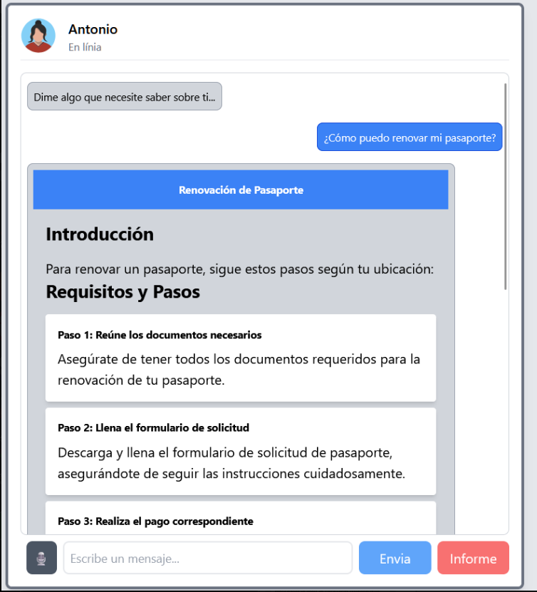
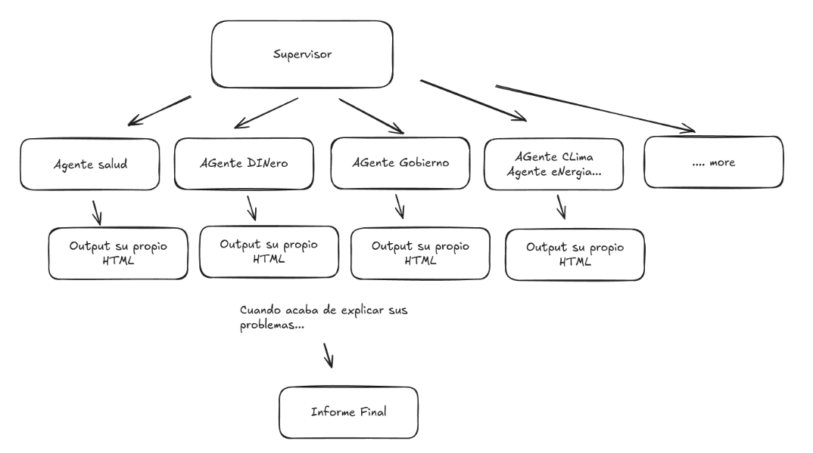

# PayRetailersUAB

Repositori per la UAB THE HACK 2025

## Overview

PayRetailersUAB is a modular and extensible platform designed to provide intelligent assistance across various domains such as health, finance, climate, energy, and more. It leverages AI agents, APIs, and tools to deliver tailored responses and solutions to user queries.

The platform is built using Python and FastAPI, with integrations for OpenAI, Groq, and other APIs to enable advanced functionalities like natural language processing, data retrieval, and HTML generation.



## Features

- **Modular Agent System**: Specialized agents for different domains (e.g., health, finance, climate).
- **Dynamic Agent Loading**: Agents are dynamically imported and configured at runtime.
- **Customizable Prompts**: Prompts for agents and supervisors can be customized via text files.
- **HTML Transformation**: Outputs are transformed into responsive HTML using Tailwind CSS.
- **Audio Transcription**: Supports transcription of audio inputs using Whisper (local or Groq API).
- **Conversation Management**: Tracks user conversations, pain points, and good points for personalized assistance.
- **API Integration**: Integrates with external APIs like Perplexity, World Bank, and NASA for data retrieval.

## Setup Instructions

### Prerequisites

- Python 3.10 or higher
- Docker (optional, for containerized deployment)
- Environment variables configured in a `.env` file (see below)

### Environment Variables

Create a `.env` file in the root directory with the following keys:

```
AZURE_OPENAI_API_KEY=<your-azure-openai-api-key>
AZURE_OPENAI_ENDPOINT=<your-azure-openai-endpoint>
AZURE_OPENAI_API_VERSION=<your-azure-openai-api-version>
GPT4O_MINI_DEPLOYMENT=<your-gpt4o-mini-deployment-name>
PERPLEXITY_API_KEY=<your-perplexity-api-key>
GROQ_API_KEY=<your-groq-api-key>
USE_LOCAL_WHISPER_API=true  # Set to false to use Groq's Whisper API
```

### Installation

1. Clone the repository:
   ```bash
   git clone <repository-url>
   cd PayRetailersUAB
   ```

2. Install dependencies:
   ```bash
   pip install -r api/requirements.txt
   ```

3. (Optional) Build and run the Docker container:
   ```bash
   docker-compose up --build
   ```

### Running the Application

1. Start the FastAPI server:
   ```bash
   uvicorn api.main:app --host 0.0.0.0 --port 8000
   ```

2. Access the API documentation at:
   ```
   http://localhost:8000/docs
   ```

## Key Components

#### Agents

Thanks to the modular design, agents can be easily added or removed to suit different use cases. The current agents include:

- **Health Agent**: Provides health-related assistance using WHO data and web searches.
- **Money Agent**: Offers financial advice and retrieves data from World Bank and ECLAC.
- **Climate Agent**: Fetches climate data and environmental risks.
- **Energy Agent**: Provides renewable energy data and sustainability tips.
- **Government Agent**: Assists with government-related queries.
- **Emigration Agent**: Helps with emigration-related queries.
- **Final Output Agent**: Generates a final summary of conversations in HTML format.


The following diagram illustrates the architecture of the agents and their interactions:



We can create new agents under our_agents folder and they will be automatically loaded, and in hands of the supervisor.

There's a special agent called `FinalOutputAgent` that generates the final HTML output based on the conversation history. This agent is responsible for summarizing the conversation and generating the final output.

#### Supervisor

The `Supervisor` class manages the routing of user inputs to the appropriate agents and ensures a seamless conversation flow.

#### Transformers

- **HTMLTransformer**: Converts agent outputs into responsive HTML using Tailwind CSS. It uses GROQ for speed, and allows LLM to auto generate our UI and components based on the output.

#### Utilities

- **Perplexity API**: Enables web searches for various agents like Health and Money.
- **Whisper Integration**: Supports audio transcription using local or Groq's Whisper API.

### Customization

- Modify prompts in the `settings/` directory:
  - `supervisor_prompt.txt`
  - `final_output_prompt.txt`
  - `whisper_model.txt`

- Add new agents by creating Python files in the `api/our_agents/` directory and exposing an `agent_instance`.


### Contributing

Contributions are welcome! Please follow the standard GitHub workflow for submitting pull requests.

### License

This project is licensed under the MIT License.

### Acknowledgments

- UAB THE HACK 2025
- OpenAI
- Groq
- Tailwind CSS
